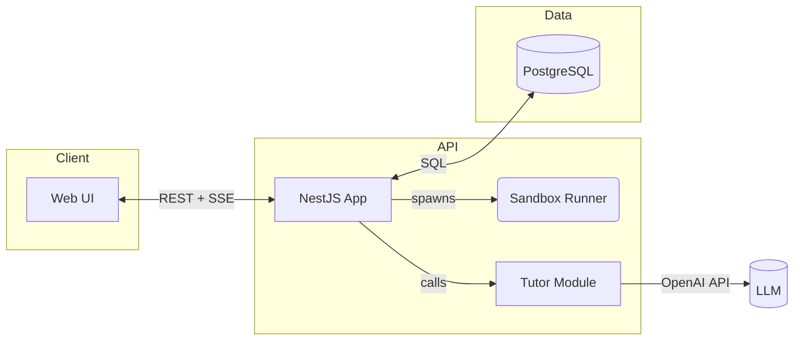
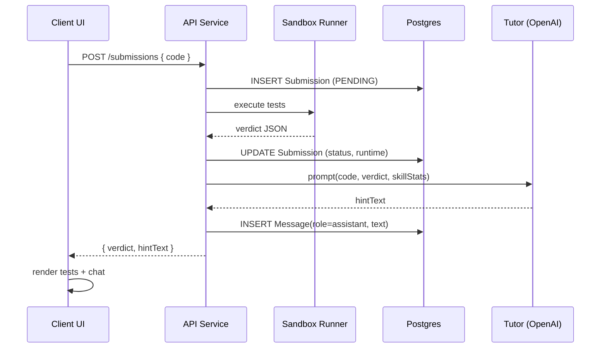
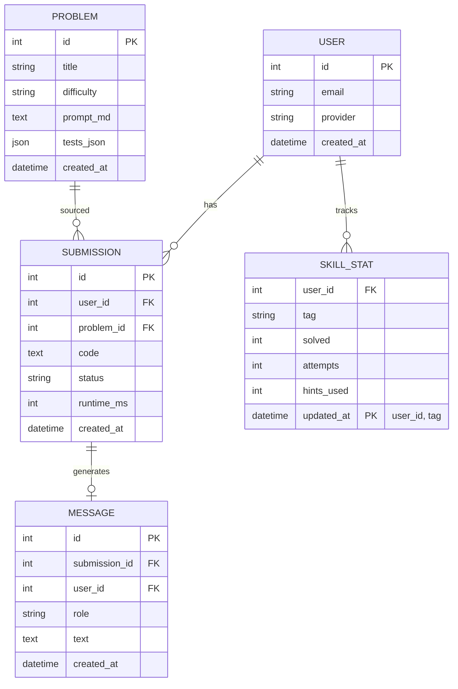

# Codify v2 — Architecture (MVP)

> *This describes the minimum set of pieces required for the v0.1 sync flow.  Everything here should fit on one laptop and a cheap PaaS instance.*

---

## 1. Runtime components

* **Web UI** – React app with problem, editor, test, and chat panes.
* **API** – single NestJS service; owns auth, CRUD, runner orchestration, tutor calls.
* **Sandbox Runner** – child process (or Docker side‑car) running `vm2` + Jest test harness.
* **Tutor Module** – pure TS class; builds prompt, hits OpenAI, returns hint text.
* **PostgreSQL** – single DB holding users, problems, submissions, messages, stats.

---

## 2. Sequence – happy‑path solve

*Timeouts*: Runner has 2 s wall‑clock; Tutor call budget 1 s.

---

## 3. Data model (ERD)

* `tests_json` holds the reference test cases; runner parses it into Jest tests.
* `MESSAGE.role` is `user` or `assistant`; chat history per problem is all messages sharing a `problem_id` (via `SUBMISSION`).
* `SKILL_STAT` is optional for v0.1; updated after each submission for adaptive curriculum later.

---

### Stretch‑goal refactor note

If latency or load becomes an issue, break the **Runner** and **Tutor** into queue‑backed worker services and replace sync HTTP with job IDs + SSE polling.  The surface API stays identical.
